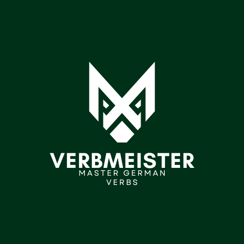

# VerbMeister

VerbMeister is a Laravel app for practicing German verbs and their prepositions through interactive quizzes, then tracking progress over time.

markdownLive: [mastergermanverbs.com](https://mastergermanverbs.com)

## Features

- Interactive quiz flow with immediate feedback
- German verb and their prepositions practice
- User progress and score tracking
- Responsive frontend powered by Vite

## Tech Stack

- PHP 8.2+
- Laravel 11
- MySQL 8
- Node.js 20+ (for frontend assets)
- Docker (optional production-like setup)

## Quick Start (Local)

1. Clone and enter the project:

```bash
git clone https://github.com/Dawitt-dev/VerbMeister.git
cd VerbMeister
```

2. Install dependencies:

```bash
composer install
npm install
```

3. Configure environment:

```bash
cp .env.example .env
php artisan key:generate
```

4. Update database settings in `.env` and run migrations (plus seed data if desired):

```bash
php artisan migrate
php artisan db:seed
```

5. Start the app and frontend dev server (in separate terminals):

```bash
php artisan serve
npm run dev
```

6. Open:

- App: `http://127.0.0.1:8000`
- Vite dev server: `http://127.0.0.1:5173`

## Quick Start (Docker)

1. Create your environment file and set DB credentials:

```bash
cp .env.example .env
```

2. Build and start containers:

```bash
docker compose up --build -d
```

3. Run migrations:

```bash
docker compose exec app php artisan migrate
```

4. Open the app:

- `http://127.0.0.1:8080`

## Useful Commands

```bash
# Run tests
php artisan test

# Build frontend assets for production
npm run build

# Stop Docker stack
docker compose down
```

## Troubleshooting

- If assets are missing locally, make sure `npm run dev` is running.
- If Docker DB fails to start, re-check `DB_*` values in `.env`.
- If permissions errors appear in Docker, rebuild with:
  `docker compose up --build -d`

## Contact

For questions or feedback, open a GitHub issue or email `dawittbeyene22@gmail.com`.
